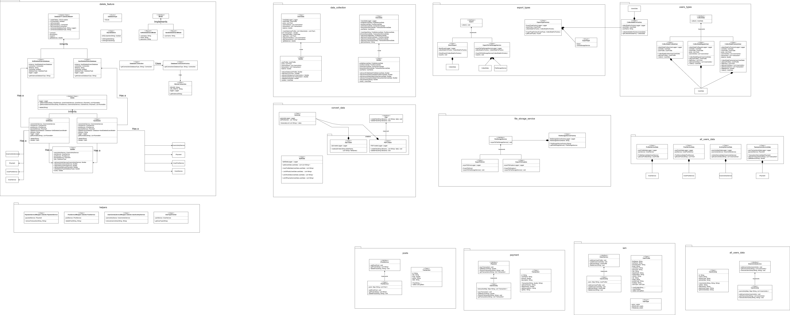

Final project template 
======================
This is the template for the final project in the course. Your application should be run on [Application.java](src%2Fedu%2Fnajah%2Fcap%2Fdata%2FApplication.java)

**Do not change any existing code in the template. You can add new classes and methods as you see fit.**

## Project Description

### all-usersData Package
This Package has four classes ```ActivityServiceData```, ```PostServiceData```, ```ProfileServiceData``` and ```TransactionsServiceData``` each one of them do the following:
- ```ActivityServiceData``` in its constructor takes a IUserActivityService object and in its getUserActivities method return a List<UserActivity>.
- ```PostServiceData``` in its constructor takes a IPostService object and in its getUserPosts method return a List<Post>.
- ```ProfileServiceData``` in its constructor takes a IUserService object and in its getUserProfile method return a UserProfile object.
- ```TransactionsServiceData``` in its constructor takes a IPayment object and in its getUserTransactions method return a List<Transaction> also getBalance method return a double object.

### data_exporting Package 
#### DataCollection 
This package continues ```UsersData``` , ```UserData``` and ```user_types```package:
- ```UsersData``` class that takes ProfileServiceData, PostServiceData, ActivityServiceData, TransactionsServiceData and String and implements it using buillder design pattern.
- ```UserData``` class that takes UserProfile, List<Post>, List<UserActivity>, List<Transaction> and double and implements it using buillder design pattern.
- ##### user_types Package
  This package contains:
  - ```CollectData``` a interface contains a collect method that returns UserData object  
  - ```CollectDataForNewUser``` a class implements CollectData and contain needed information for new user, UserData object       and overrided collect method.
  - ```CollectDataForRegularUser``` a class implements CollectData and contain needed information for Regular user, UserData     object and overrided collect method.
  - ```CollectDataForPremiumUser``` a class implements CollectData and contain needed information for Premium user, UserData     object and overrided collect method.
  -  ```CollectDataForFactory```  a class implemented to verifi __factory design pattern__ this class get a UserData object      and it has a ```getCollectionDataFor``` method that returns a CollectData object based on __user type__ with it could be       (```CollectDataForNewUser```, ```CollectDataForRegularUser```, ```CollectDataForPremiumUser```).
  
### export Package
#### export_types 
This package contains:
- ```Export``` a interface contains a export method. 
- ```DirectExport``` a class implements Export and contain CollectDataForFactory object that contains user data to export using overrided export method.
- ```ExportToFileStorageService``` a class implements Export and contain CollectDataForFactory object that contains user data to export using overrided export method to file storage service picked by the user.
- ```ExportType``` contain export types enums.
- ```ExportTypeFactory``` a class contains ExportType and CollectDataForFactory objects and using ```getExportType``` method that returns Export object based on value of ExportType object with CollectDataForFactory object.

#### file_storage_service
This package contains:
- ```FileStorageService``` a interface contains a exportToFileStorageService method.
- ```ExportToDrive``` a class the override exportToFileStorageService method to export zip file to drive file storage services.
- ```ExportToDropbox``` a class the override exportToFileStorageService method to export zip file to dropbox file storage services.
- ```FilesStorageServiceFactory``` a class decid which service to export file to based on fileStorageServiceName value.

### convert_data
a package contains the process to convert data and direct export

#### IFile interface
This interface defines a contract for classes that handle file creation and deletion operations within the `edu.najah.cap.convert_data` package. It ensures consistency and modularity in file-related tasks.

## **Methods**

- **createFile(String filename, List<String> data):**
  - Creates a file with the specified filename.
  - Takes a list of strings as the file content.
  - Implementation details are left to concrete classes.
- **deleteFile(String filename):**
  - Deletes an existing file with the given filename.
  - Implementation details are left to concrete classes.

## **Purpose**
- Promotes code reusability and maintainability by defining a common interface for file operations.
- Allows different file-handling implementations to be swapped without affecting other parts of the code.
- Facilitates testing by enabling mock file implementations for isolated testing.

## **Usage**

1. **Implement the interface:**
   ```
   public class PDFCreator implements IFile {
       // Implement createFile and deleteFile methods for PDFs
   }
   ```

2. **Use instances in other classes:**
   ```
   IFile fileHandler = new PDFCreator(); // Or any other implementation
   fileHandler.createFile("my_file", data);
   fileHandler.deleteFile("my_file");
   ```

## **Benefits**
- **Decoupling:** Separates file operations from other logic for better organization and flexibility.
- **Polymorphism:** Allows using different file handling implementations interchangeably.
- **Testability:** Enables mocking for controlled testing scenarios.


#### creators
a package contains the process to direct export like install zip folder has pdfs about users data

##### PDFCreator
This class provides functionality to create and delete PDF files using the iText library. It adheres to the IFile interface for consistent file operations.

## Key Features
Creates PDF files with specified filenames and content.
Saves generated PDFs to the user's Downloads directory.
Deletes existing PDF files from the Downloads directory.
Logs file operations for debugging and tracking.

## Usage

**Import the class:**
```
Java import edu.najah.cap.convert_data.creators.PDFCreator;
```
**Create an instance:**
```
JavaPDFCreator pdfCreator = new PDFCreator();
```
**Create a PDF file:**
``` 
Java List<String> data = Arrays.asList("Line 1", "Line 2", "Line 3");
pdfCreator.createFile("my_pdf_file", data);
```

**Delete a PDF file:**
```
Java pdfCreator.deleteFile("my_pdf_file");
```

## Dependencies
iText library for PDF generation: https://itextpdf.com/

## Logging
Uses a Logger named PDFCreatorLogger to log file operations.
Check log files for error messages or debugging information.

##### ZipCreator
This class provides functionality to create zip archives containing multiple PDF files. It automatically saves generated zip files to the user's Downloads directory and logs file operations for debugging and tracking.

## **Key Features**
- Creates zip archives with specified folder names and PDF files.
- Locates PDF files in the user's Downloads directory.
- Handles potential errors and logs them appropriately.

## **Usage**

**Import the class:**
   ```
   import edu.najah.cap.convert_data.creators.ZipCreator;
   ```

**Call the createZipFolder method:**

   ```
   List<String> fileNames = Arrays.asList("file1", "file2", "file3");  
   ZipCreator.createZipFolder("my_zip_archive", fileNames);
   ```

## **Assumptions**

- files to be added to the zip archive are located in the user's Downloads directory.
- Files have a ".pdf" extension.

## **Logging**

- Uses a `Logger` named `ZipCreatorLogger` to log file operations.
- Check log files for error messages or debugging information.

## **Additional Notes**
- Saves zip archives to the user's Downloads directory by default.

#### Generate class
This class orchestrates the generation of multiple PDF files from provided data and then compresses them into a zip archive for convenient distribution. It leverages the `PDFCreator` and `ZipCreator` classes for file creation and archiving, respectively.

## **Key Features**
- Generates multiple PDF files with specified names and content.
- Combines generated PDFs into a zip archive named "UserData.zip".
- Deletes individual PDF files after creating the zip archive.
- Uses logging for tracking file operations and debugging.

## **Usage**

1. **Instantiate the class:**

   ```
   List<List<String>> data = ... // long code to prepare your data in lists of strings
   Generate generator = new Generate(data);
   ```

2. **The constructor handles file generation and zipping automatically.**

## **Assumptions**
- Input data is organized as lists of strings, where each list represents a separate PDF file.
- PDFCreator and ZipCreator classes are accessible within the same package.

## **Logging**
- Uses a `Logger` named `generateLogger` to log file operations.
- Check log files for error messages or debugging information.

## **Additional Notes**
- Saves PDFs to the user's Downloads directory before zipping them.
- Deletes PDFs after zipping to conserve space.

#### SplitData
This class acts as a data organizer, extracting and structuring relevant information from a `UserData` object into separate lists for profile data, posts, activities, and payments. It prepares data for downstream processing and file generation.

## **Key Features**

- Extracts user profile, posts, activities, and payment data into distinct lists.
- Conditionally extracts data based on availability in the `UserData` object.
- Logs extraction processes for debugging and tracking.

## **Usage**
1. **Instantiate the class:**
   ```
   SplitData splitter = new SplitData();
   ```

2. **Call the `split` method with a `UserData` object:**
   ```
   List<List<String>> organizedData = splitter.split(userData);
   ```

  - The `organizedData` will contain lists for profile, posts, activities, and/or payments, depending on available data.

## **Methods**
- **split(UserData userData):**
  - Extracts and organizes data into lists.
  - Returns a list of lists, where each inner list represents a data category.
- **UserProfileData(UserData userData):**
  - Extracts user profile data into a list.
- **ListOfPosts(UserData userData):**
  - Extracts post data into a list.
- **ListOfActivities(UserData userData):**
  - Extracts user activity data into a list.
- **ListOfPayments(UserData userData):**
  - Extracts payment data into a list.

## **Logging**
- Uses a `Logger` named `SplitDataLogger` to log extraction processes.
- Check log files for progress information or debugging.

## **Additional Notes**
- Operates on the assumption that the `UserData` object contains valid data.
- Consider adding error handling for unexpected data structures.
- Designed to prepare data for subsequent file generation or other processing tasks.

---

### delete_feature
This package contains 4 classes, 1 enum and `internal` package:
* **DeleteType**: an enum that contains the type of the database, such as `SQLITE`, `MYSQL`, etc...
* **Delete**: an abstract class that contains the abstract method `delete()` and 2 methods that are essential for deleting `getRunnable()` and `getRunnableAndCheck()`. This helps in removing duplicate code and abstracts the checking of the `userType` whether it's `NEW_USER`, `REGULAR_USER` or `PREMIUM_USER`.
* **HardDelete**: a class that extends `Delete` and implements the `delete()` method. This class is used to delete the data while saving the username in the database.
* **SoftDelete**: a class that extends `Delete` and implements the `delete()` method. This class is used to delete the data while saving the username, email and password in the database.
* **SQLValidation**: a class that contains the validation methods for the SQL database.

### delete_feature.internal
This package contains 2 packages:
* **database**: a package that contains the essential files for the database.
* **delete_service**: a package that contains the classes that are used to delete the data of the other services.

### database
This package contains the following classes, records, and interfaces:
* **Database<T extends Model>**: an abstract class that contains abstract methods and two methods that help in avoiding duplicate code.
    * `connect()`
    * `disconnect()`
    * `createTable()`
    * `insert(T)`
    * `isConnected()`
    * `setConnected(boolean)`
    * `getConnection()`
    * `setConnection(Connection)`
    * `connect(DatabaseType, String)`
    * `connect(DatabaseType, String, Logger)`
* **DatabaseConnection**: a class that has the method `getConnection(DatabaseType, String)` that returns the connection of the database. It uses DatabaseConnectionFactory to get the appropriate connection of the database based on the type.
* **DatabaseConnectionFactory**: a class that has the method `getConnection(DatabaseType, String)` that returns the connection of the database based on the type. This helps in the Open-Closed Principle.
* **Model**: an interface to mark a record as a model so that it can be used in the database.
* **HardDeletedUserModel**: a record that implements the `Model` interface. It is used to store the username of the deleted user.
* **SoftDeletedUserModel**: a record that implements the `Model` interface. It is used to store the username, email and password of the deleted user.
* **HardDeletedUserDatabase**: a class that extends `Database<HardDeletedUserModel>` and implements the abstract methods. It is used to connect to the database of the hard deleted users and to insert the data. It also has the method `getInstance(DatabaseType, String)` that returns the instance of the database based on the type. This helps in the Singleton Pattern.
* **SoftDeletedUserDatabase**: a class that extends `Database<SoftDeletedUserModel>` and implements the abstract methods. It is used to connect to the database of the soft deleted users and to insert the data. It also has the method `getInstance(DatabaseType, String)` that returns the instance of the database based on the type. This helps in the Singleton Pattern.
* **SQLiteConnection**: a class that returns the connection of the SQLite database.

### delete_service
This package is used to delete the user's data based on the service that the user is using. It contains the following classes:
* **IServiceDeleter**: an interface that contains the method `delete(String)`.
* **PaymentDeleter**: a class that implements `IServiceDeleter` and has the method `delete(String)` that deletes the user's payment data (only works on premium users).
* **PostsDeleter**: a class that implements `IServiceDeleter` and has the method `delete(String)` that deletes the user's posts data.
* **UserActivityDeleter**: a class that implements `IServiceDeleter` and has the method `delete(String)` that deletes the user's activity data (does not work on new users).
* **UserServiceDeleter**: a class that implements `IServiceDeleter` and has the method `delete(String)` that deletes the user's data.

## helpers
This package contains the following helper classes:
* **PaymentServiceWrapper**: a class that wraps `PaymentService` and overrides the method `removeTransaction(String, String)` to delete the user's payment data in a faster way.
* **PostServiceWrapper**: a class that wraps `PostsService` and overrides the method `deletePost(String)` to delete the user's posts data in a faster way.
* **UserActivityServiceWrapper**: a class that wraps `UserActivityService` and overrides the method `deleteUserActivity(String)` to delete the user's activity data in a faster way.
* **UserTypeFetcher**: a class that contains the method `getUserType(String)` that returns the type of the user based on the username.

# 